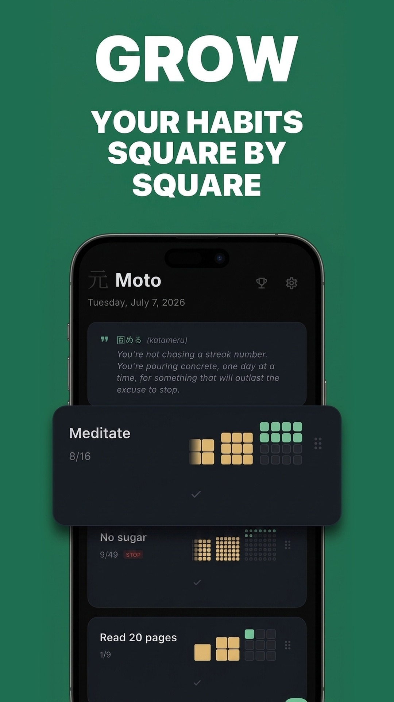
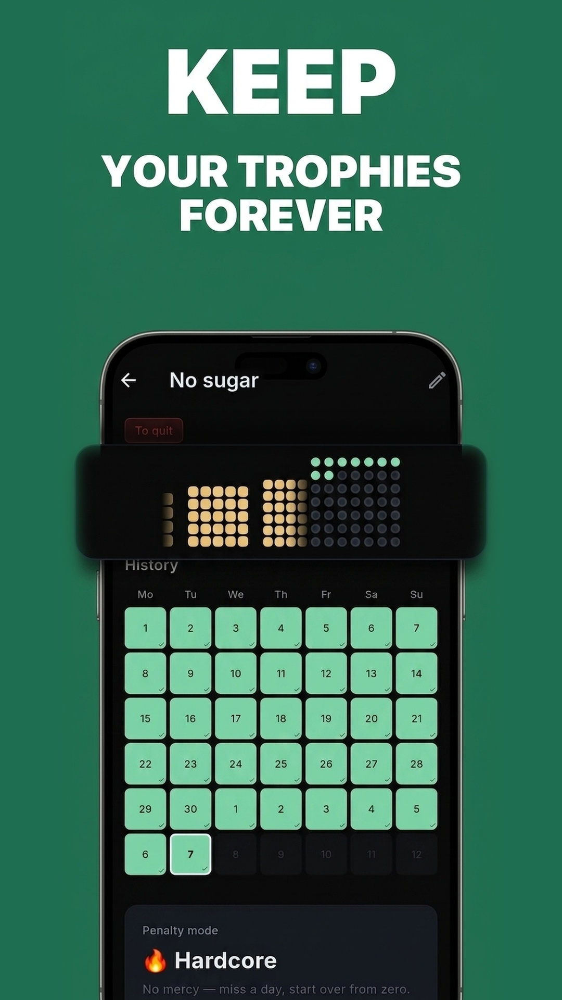
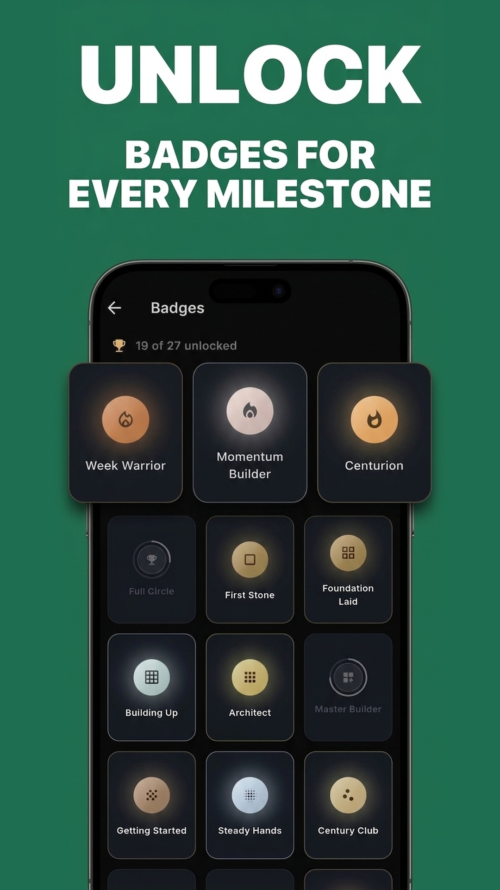
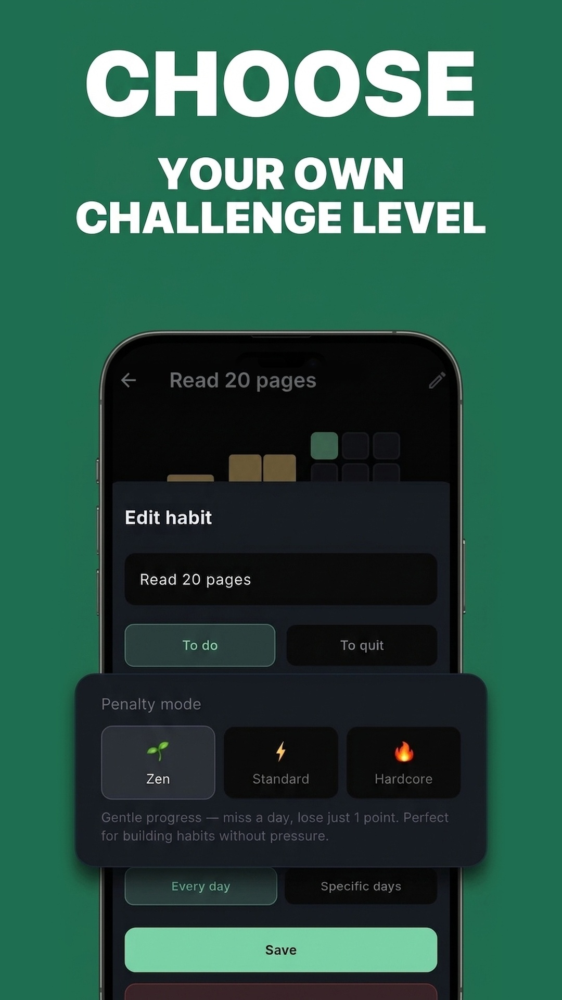
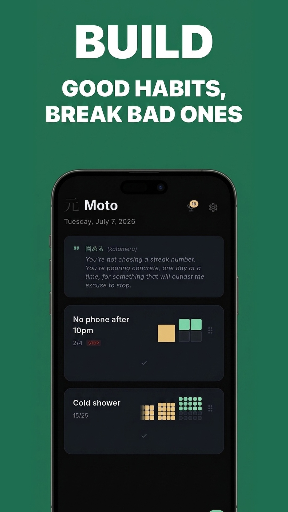
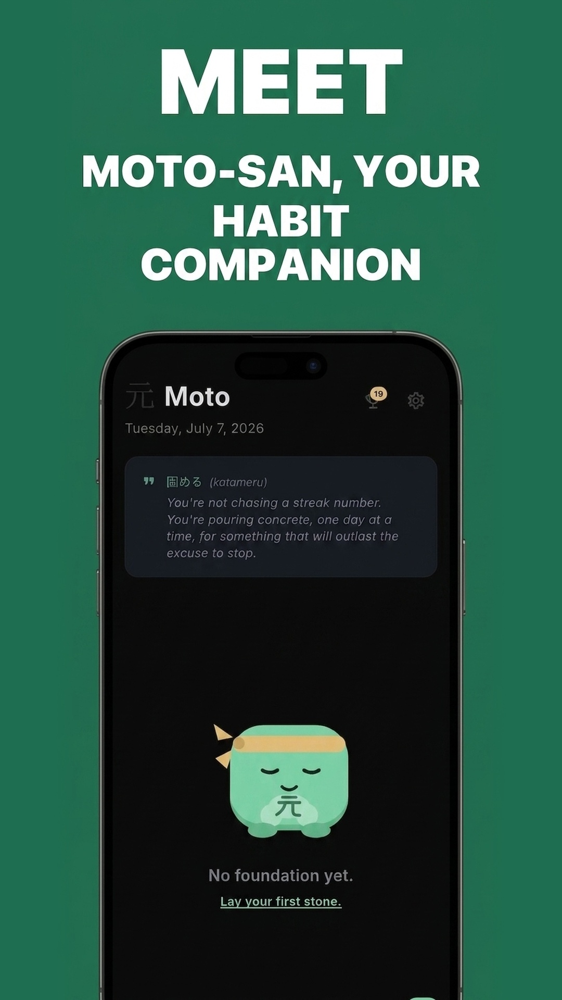

# Moto 基

A habit-tracking app with a square-by-square progression system, offline-first, trilingual (FR/EN/JA).

**[Get it on Google Play](https://play.google.com/store/apps/details?id=com.rachoucorp.moto)**

> Français / English — see [Concept](#concept) below, code and comments are in English.

---

## Concept

Every habit builds up square by square, using a sum-of-squares progression:

| Square | Days to complete | Cumulative days |
|---|---|---|
| 1×1 | 1 | 1 |
| 2×2 | 4 | 5 |
| 3×3 | 9 | 14 |
| 4×4 | 16 | 30 |
| ... | n² | Σ n² |

Completed squares become trophies. Miss a scheduled day and you're penalized — by how much depends on the mode you pick per habit:

- **Zen** — lose one day of streak
- **Standard** — drop back to the last fully completed square
- **Hardcore** — streak resets to zero

Habits aren't locked to daily: each one can be scheduled on specific weekdays (e.g. 3x/week), and rest days don't break the streak. A badge system (streaks, square milestones, total days, habit count, plus a couple of secret ones) rewards consistency beyond the raw counter.

---

## Tech Stack

| Layer | Tech |
|---|---|
| Framework | Flutter / Dart |
| Persistence | SharedPreferences (fully offline, no backend) |
| Localization | Flutter's official `l10n`/ARB tooling — FR / EN / JA |
| Notifications | Local reminders per habit |
| Monetization | In-app purchase (Pro tier) |

---

## Architecture

```
lib/
├── main.dart
├── models/          # Habit (streak/square math, penalties), AppBadge
├── screens/         # splash → onboarding → home → habit_detail / badges / pro / settings
├── services/        # storage, notifications, badges, subscriptions, language, sharing
└── widgets/         # square grid, calendar, badge medallions, celebration animations
```

The streak/square math (`Habit.squareProgressFor`) is the single source of truth shared by the progress UI, the penalty calculation, and badge unlocking, so they can't drift apart — and streaks are recalculated by replaying the full day-by-day history rather than incrementally, so editing a past day always produces a consistent result.

---

## Name

**Moto** (基) — "the base", "the origin" in Japanese.

---

## Screenshots

<p>
  
  
  
  
  
  
</p>
